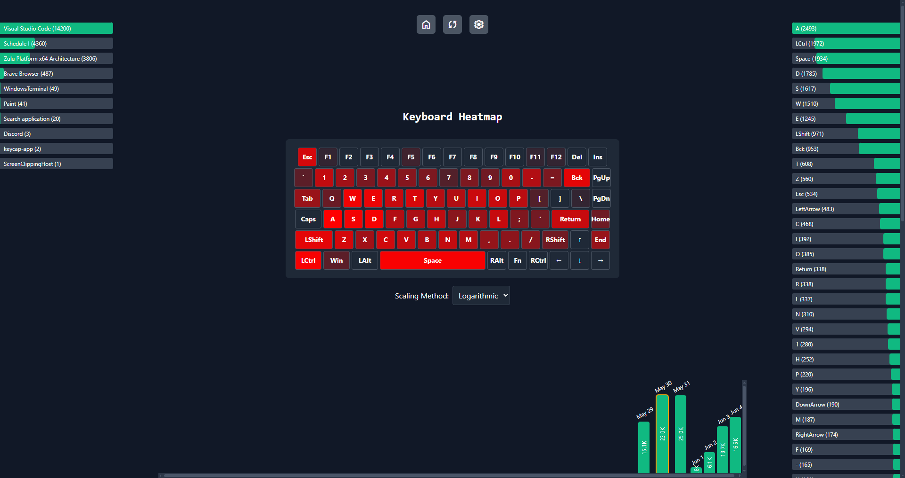

# Keycap
Keycap is a desktop application that tracks and visualizes your keyboard usage.
Built with Tauri (Rust, Vuejs) for high performance and minimal memory usage when running in the background.

## Features

- Real-time keyboard usage tracking
- Visual heatmap of key presses
- Click count statistics
- Date-based usage metrics
- App-based usage metrics

## Installation

To install Keycap on your system, follow these steps:

1. Go to the [Releases](https://github.com/t4skmanag3r/keycap-app/releases) page of the Keycap repository.
2. Download the latest `.msi` installer file.
3. Run the downloaded `.msi` file and follow the installation prompts.
4. Once installed, you can launch Keycap from your Start menu or desktop shortcut.

### Enable Autostart

To have Keycap run automatically when your system starts:

1. Open the Keycap application.
2. Look for the settings button at the top.
3. Toggle on "Enable Autostart".

This will ensure Keycap starts tracking your keyboard usage as soon as you log into your system.